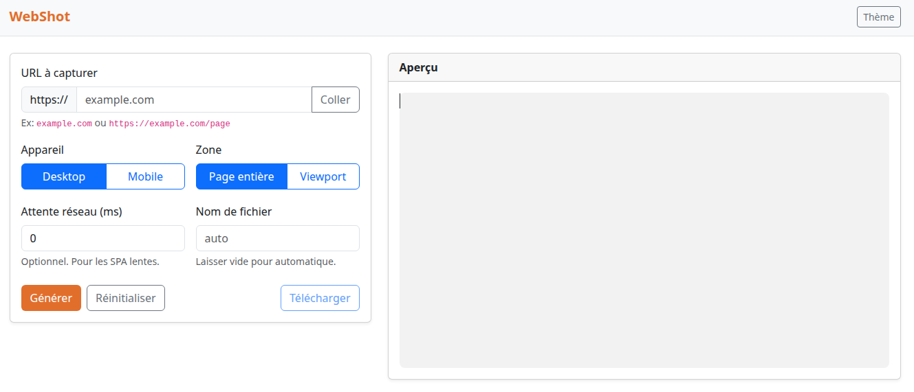

# 🖼️ WebShot – Capture d’écran d’une page web avec Playwright

Application légère (FastAPI + Playwright + Bootstrap) permettant de générer des captures d’écran complètes ou partielles d’une page web selon une URL donnée.  
Interface responsive, choix Desktop/Mobile, délai optionnel, export PNG instantané.

---

## 🚀 Fonctionnalités

- Entrée d’une **URL** à capturer  
- Choix du **type d’appareil** : `desktop` ou `mobile`  
- Choix de la **zone de capture** : `page entière` ou `viewport`  
- Option d’**attente personnalisée** (pour les pages SPA ou animées)  
- Téléchargement direct de l’image PNG  
- Interface responsive sous **Bootstrap 5**  
- Thème clair/sombre et réinitialisation instantanée du formulaire  

---

## 🧱 Structure du projet

```
.
├─ app.py                # API FastAPI (endpoint /api/screenshot)
├─ requirements.txt      # Dépendances Python
├─ Dockerfile            # Image Docker prête à l’emploi
├─ docker-compose.yml    # Stack locale
└─ static/
   └─ index.html         # Interface web élégante (Bootstrap)
```

---

## ⚙️ Installation locale

### 1. Cloner et préparer l’environnement

```bash
git clone https://github.com/<votre-repo>/webshot.git
cd webshot
python -m venv .venv
source .venv/bin/activate
pip install -r requirements.txt
python -m playwright install --with-deps chromium
```

### 2. Lancer le serveur

```bash
uvicorn app:app --reload --host 0.0.0.0 --port 8000
```

### 3. Accéder à l’interface

Ouvrez :  
👉 [http://localhost:8000](http://localhost:8000)

---

## 🐳 Utilisation avec Docker

### Build & Run

```bash
docker compose up -d --build
```

Puis ouvrez [http://localhost:8000](http://localhost:8000)

---

## 🧩 API Endpoint

### `POST /api/screenshot`

| Champ     | Type     | Valeurs possibles | Description |
|------------|-----------|------------------|--------------|
| `url`      | string   | ex: `https://example.com` | URL à capturer |
| `device`   | string   | `desktop` / `mobile` | Type d’appareil simulé |
| `mode`     | string   | `full` / `viewport` | Zone capturée |
| `delay`    | int (ms) | ex: `1500` | Attente avant capture |

**Exemple de requête :**

```bash
curl -X POST http://localhost:8000/api/screenshot   -H "Content-Type: application/json"   -d '{"url":"https://example.com","device":"desktop","mode":"full","delay":1000}'   --output screenshot.png
```

---

## 🧠 Notes techniques

- Utilise **Playwright** (Chromium headless) pour la capture.  
- Évite d’appeler des ressources internes ou non publiques (risque SSRF).  
- Timeout réglé à 30s pour le chargement de page.  
- Les polices et médias sont ignorés pour accélérer la capture.  
- En cas d’erreur HTTP (404, 500, timeout), le serveur renvoie un JSON :
  ```json
  {"detail":"Capture échouée: <erreur>"}
  ```

---

## 🧰 Personnalisation

- **Thème** : le bouton « Thème » alterne entre clair et sombre.  
- **Nom de fichier automatique** : basé sur domaine + mode + timestamp.  
- **Réinitialisation** : rétablit le formulaire et l’aperçu initial.  
- **Extensions futures** possibles :
  - Sélecteur de format (`jpg`, `webp`)  
  - Capture multi-résolutions  
  - Historique local (IndexedDB)  
  - Auth Basic (protection API)

---

## 🧑‍💻 Licence

MIT — libre réutilisation, modification et distribution.

---

## 📸 Aperçu


